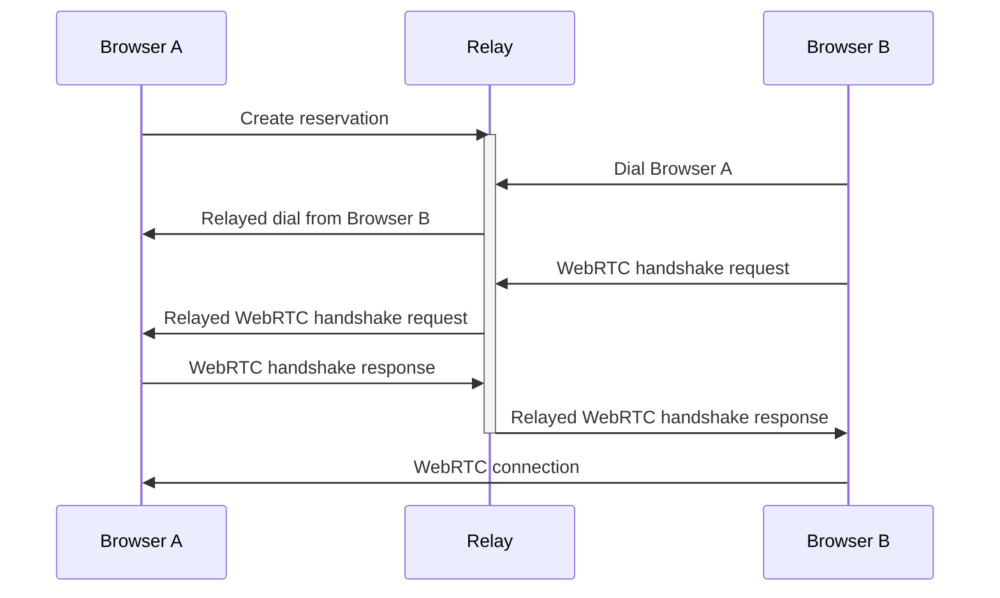

# Relay

```mermaid
sequenceDiagram
    Browser A->>Relay: Create reservation
    activate Relay
    Browser B->>Relay: Dial Browser A
    Relay->>Browser A: Relayed dial from Browser B
    Browser B->>Relay: WebRTC handshake request
    Relay->>Browser A: Relayed WebRTC handshake request
    Browser A->>Relay: WebRTC handshake response
    Relay->>Browser B: Relayed WebRTC handshake response
    deactivate Relay
    Browser B->>Browser A: WebRTC connection
```